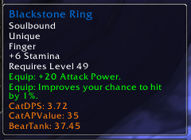
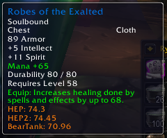
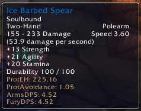
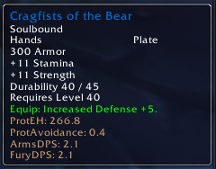
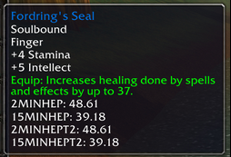
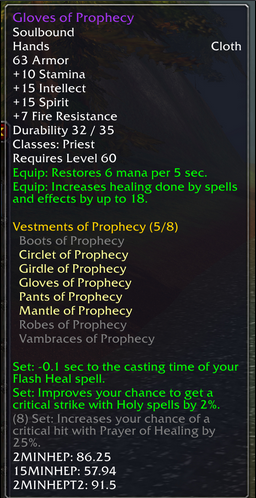

# Vanilla Rating Buster

A very basic AddOn that calculates ratings for various specs and classes based on stat weights defined by the community. 


## How to install

1. Download Release
2. Unpack the Zip
3. Copy both "VanillaRatingBuster" and "BonusScanner" folders to Wow-Directory\Interface\AddOns
4. Restart Wow


### Druid

| Label | Description |
|:----- |:----------- |
| HEP   | Healing Effective Power at initial gearing levels, all the way up until the T2 set bonus is active (up to BWL) |
| HEPT2Bonus  | Healing Effective Power at gearing levels, once the T2 set bonus is active (BWL) |
| HEPNAXX | Healing Effective Power at NAXX gearing levels (not yet active) |
| CatDPS | Effective DPS in Cat form |
| CatAPValue | Effective AP value when in Cat form |
| BearTank | Effective survival rating when in Bear form |





**Druid Sources**

 - [Druid Gear Listing with stat weights](https://docs.google.com/spreadsheets/d/1wGBasFY8fFGpBtiD1TAUBB99wxboCSVh5MW_6b_z0oU/pubhtml#)

### Warrior

| Label         | Description                                                                                                                                        |
|:--------------|:---------------------------------------------------------------------------------------------------------------------------------------------------|
| ProtEH        | Effective health value                                                                                                                             |
| ProtAvoidance | Effective avoidance from pure dodge/parry or calculated from +Def                                                                                  |
| ArmsDPS       | Effective DPS value, with +Hit prioritized very highly until the 9% cap. This can also be used if you are Fury and only care about special attacks |
| FuryDPS       | Effective DPS value, with +Hit prioritized very highly until the 14% cap                                                                           |






**Warrior Sources**

 - Landsoul's Excel sheet (v2.x)
 - [Lurker Lounge: Warrior Weapons and DPS discussion](http://www.lurkerlounge.com/forums/thread-4078.html)


### Paladin

| Label         | Description                                                              |
|:--------------|:-------------------------------------------------------------------------|
| PaladinRetDPS | Effective DPS value, with +Hit prioritized very highly until the 9% cap. |
| PaladinHEP    | Effective Healing Power                                                  |
| PaladinProtEH | Effective health value                                                   |


**Paladin Sources**

 - No good ones as yet. Most of the above is based of existing Warrior (for Tank and DPS) and Shaman (for HEP) weights


### Priest

| Label               | Description                                                                          |
|:--------------------|:-------------------------------------------------------------------------------------|
| PriestHEP_2M        | Effective Healing Power on a 2 minute combat fight (short)                           |
| PriestHEP_2M_T2     | Effective Healing Power on a 2 minute combat fight (short) with T2 3-piece set bonus |
| PriestHEP_15M       | Effective Healing Power on a 15 minute combat fight (long)                           |
| PriestHEP_15M_T2    | Effective Healing Power on a 15 minute combat fight (long) with T2 3-piece set bonus |
| PriestShadowDPS_2M  | DPS values for short fights <2mins                                                   |
| PriestShadowDPS_15M | DPS values for longer fights 2-15min                                                 |






**Priest Sources**

 - [Nostalrius Priest Forum](https://forum.nostalrius.org/viewtopic.php?f=39&t=31668)
 - [Priest Gear Listing with stat weights](https://docs.google.com/spreadsheets/d/1l2o5WhYf18AsprwRoLYvuaSP96Y2xxJE743xXyenfHk)
 - [Shadow Priest Theorycraft by Killerduki](https://forum.nostalrius.org/viewtopic.php?f=39&t=44912)


## FAQ

**How does it calculate a rating?**
It uses the BonusScanner AddOn to get bonuses, including enchants for an item and then uses the stat weights for your class to calculate an overall rating

**What about stats with weight changes at a certain (eg. Hit) cap?**
These can be specified as `{threshold-value, before-weight, after-weight}`. (eg. `["TOHIT"] = { 8, 100, 1.811 }`)

**Why doesn't it always show a rating?**
If the rating is `0` then it's not shown (eg. HEP value on tanking gear)

**Why does it need a modified version of BonusScanner?**
The default BonusScanner ignores normal Armor on items and scans only for 'bonus' Armor. For tank ratings we need the base Armor value instead. The original author of BonusScanner is/was Crowley and is available [here](https://wow.curseforge.com/projects/project-1352)

**My class isn't supported! Why not?**
I don't know other classes well enough or have weights for them. If you do feel free to provide them in an Issue ticket.


## Sources and Weights

 - Some weights are defined as simple `TYPE = WEIGHT`
 - Others are defined as `{ THRESHOLD, BELOW_THRESHOLD_WEIGHT, AFTER_THRESHOLD_WEIGHT }`

```lua
  ["DruidCatDPS"] = {
    ["STR"]         = 0.19075,
    ["AGI"]         = 0.0893452,
    ["CRIT"]        = 1.875,
    ["TOHIT"]       = { 8, 1.811, 0 }, 
    ["ATTACKPOWER"] = 0.0953333
  },
```


