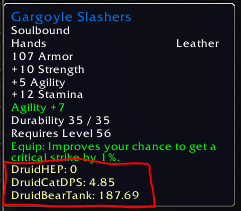

# Vanilla Rating Buster

A very basic AddOn that calculates ratings for various specs and classes based on stat weights defined by the community. 



## How to install

1. Download [Release](https://github.com/kxseven/VanillaRatingBuster/releases/latest)
2. Unpack the Zip
3. Copy both "VanillaRatingBuster" and "BonusScanner" folders to Wow-Directory\Interface\AddOns
4. Restart Wow


## FAQ

**How does it calculate a rating?**
It uses the BonusScanner AddOn to get bonuses, including enchants for an item and then uses the stat weights for your class to calculate an overall rating

**Why doesn't it always show a rating?**
If the rating is `0` then it's not shown (eg. HEP value on tanking gear)

**Why does it need a modified version of BonusScanner?**
The default BonusScanner ignores normal Armor on items and scans only for 'bonus' Armor. For tank ratings we need the base Armor value instead.

**My class isn't supported! Why not?**
I don't know other classes well enough or have weights for them. If you do feel free to provide them in an Issue ticket.


## Sources and Weights

**Druid**
```lua
  ["DruidHEP"]= {
    ["INT"]=0.60, ["MANAREG"]=4.00, ["HEAL"]=1.00, ["SPELLCRIT"]=7.50, ["SPI"]=0.30
  },
  ["DruidHEP2"]= {
    ["INT"]=0.30, ["MANAREG"]=3.00, ["HEAL"]=1.00, ["SPELLCRIT"]=10.00, ["SPI"]=0.45
  },
  ["DruidHEPNAXX"]= {
    ["INT"]=0.30, ["MANAREG"]=3.00, ["HEAL"]=1.20, ["SPELLCRIT"]=12.00, ["SPI"]=0.23
  },
  ["DruidCatDPS"]= {
    ["STR"]=0.19075, ["AGI"]=0.0893452, ["CRIT"]=1.875, ["TOHIT"]=1.811, ["ATTACKPOWER"]=0.0953333
  },
  ["DruidBearTank"]= {
    ["AGI"]=2.29, ["ARMOR"]=0.79727, ["DEFENSE"]=4.7, ["DODGE"]=39.5, ["STA"]=6.242
  },
```

**Shaman**
```lua
  ["ShamanHEP"]= {
    ["INT"]=0.20, ["MANAREG"]=1.00, ["HEAL"]=0.14, ["SPELLCRIT"]=0.00, ["SPI"]=0.00
  }
```


## Attributions

 - The original author of BonusScanner is/was Crowley and is available [here](https://wow.curseforge.com/projects/project-1352)
 - Some of the code for VannillaRatingBuster was derived from ShaguScore and is available [here](http://shagu.org/shagucollection/)
